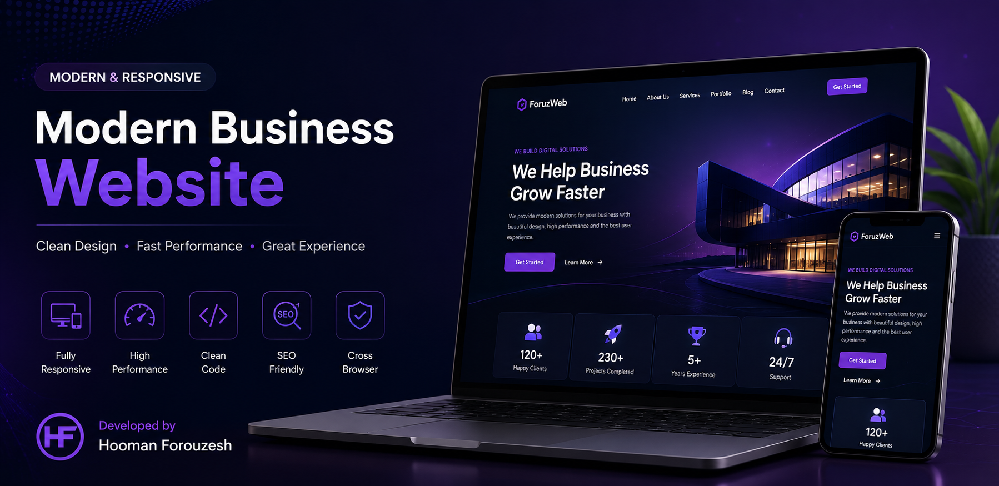

<p align="center">

  

</p>

<p align="center">
  <h1 align="center">🏢 Modern Business Website</h1>
  <p align="center">
    Premium Responsive Business Website designed with modern UI/UX principles.
  </p>

  <p align="center">
    
  </p>
</p>

---

# ✨ Overview

This project is a modern business website focused on performance, responsive design, accessibility, and user experience.

It demonstrates a professional landing page architecture suitable for agencies, startups, software companies and corporate businesses.

---

# 🚀 Features

- Modern UI/UX
- Fully Responsive
- Mobile First Design
- Clean HTML5
- CSS3 Animations
- JavaScript Interactions
- SEO Friendly
- Fast Loading
- Cross Browser Compatible
- Optimized Assets
- Smooth Scrolling
- Modern Components

---

# 🛠 Tech Stack

| Technology | Usage |
|------------|------|
| HTML5 | Structure |
| CSS3 | Styling |
| JavaScript | Interactions |
| Responsive Design | Mobile Support |

---

# 📁 Project Structure

```text
Business Website
│
├── index.html
├── css/
├── js/
├── images/
├── assets/
└── README.md
```

---

# 🎯 Goals

- Professional UI
- Responsive Experience
- High Performance
- Clean Architecture
- SEO Optimization

---

# 📱 Responsive

✔ Desktop

✔ Laptop

✔ Tablet

✔ Mobile

---

# 🌍 Live Website

https://foruzweb.ir

---

# 👨‍💻 Developer

**Hooman Forouzesh**

Website

https://foruzweb.ir

GitHub

https://github.com/Hooman-Forouzesh

LinkedIn

https://linkedin.com/in/hooman-forouzesh

---

# ⭐ Support

If you like this project, please consider giving it a ⭐ on GitHub.
